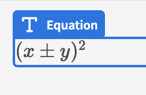
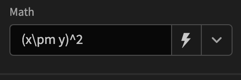

# Budibase-equation
Using this plugin you can display any equation you want with the LaTeX syntax for equations.




# Description
Display math equations using the LaTeX syntax in budibase.

Find out more about [Budibase](https://github.com/Budibase/budibase).

## Instructions

To build your new  plugin run the following in your Budibase CLI:
```
budi plugins --build
```

You can also re-build everytime you make a change to your plugin with the command:
```
budi plugins --watch
```

